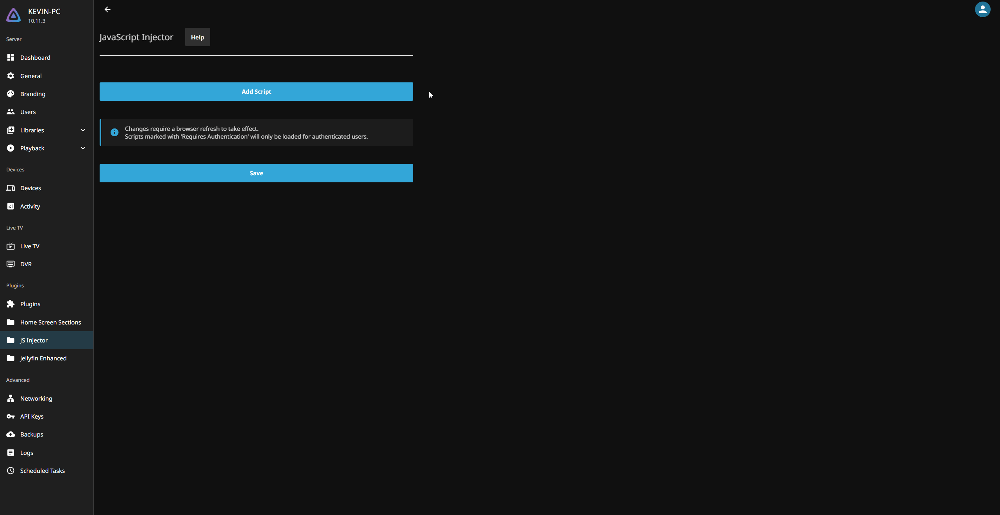
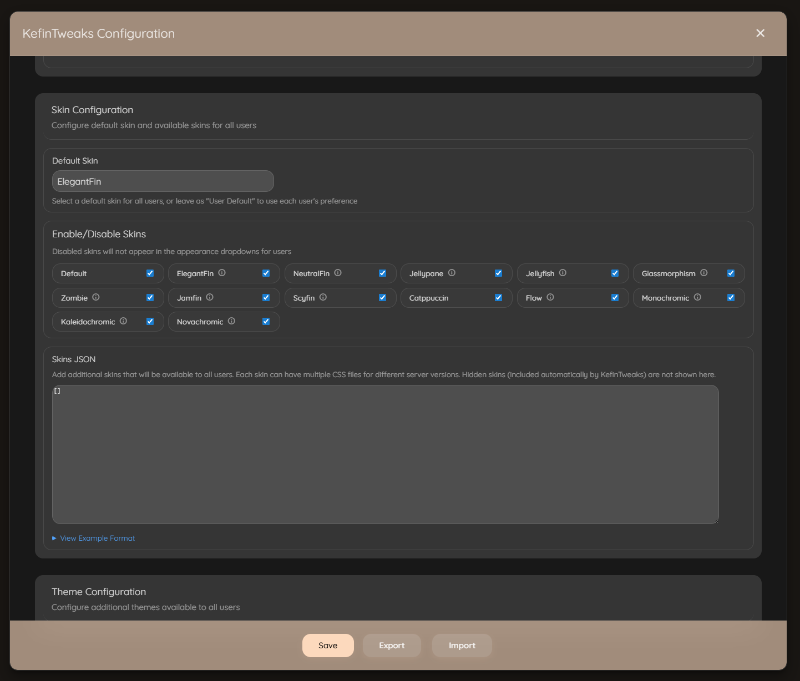
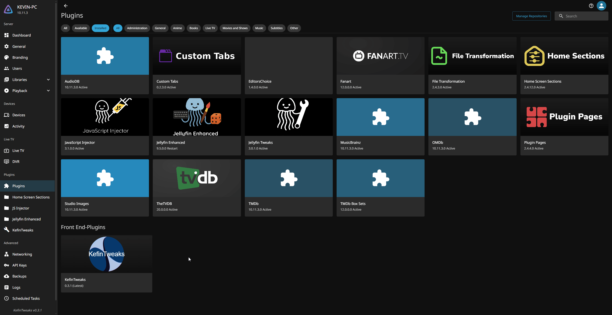
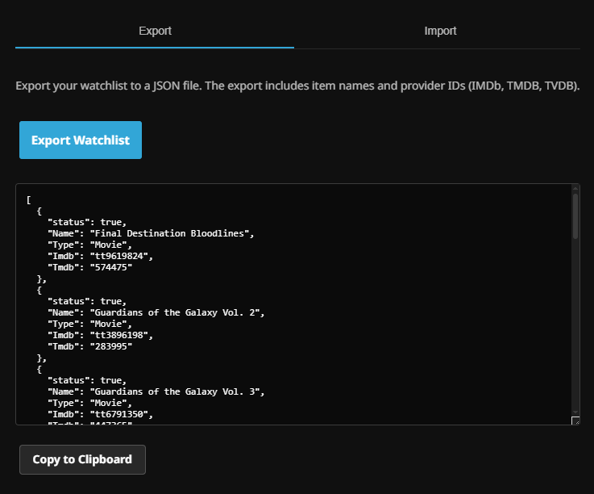
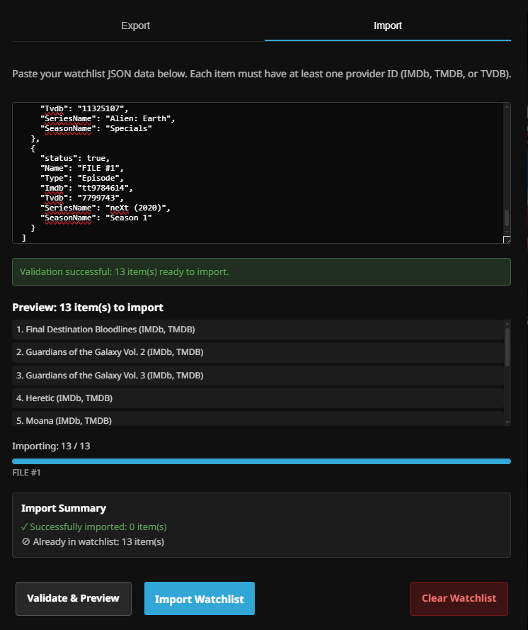
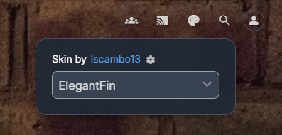
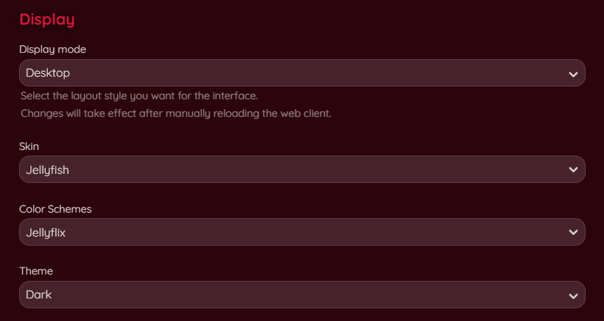
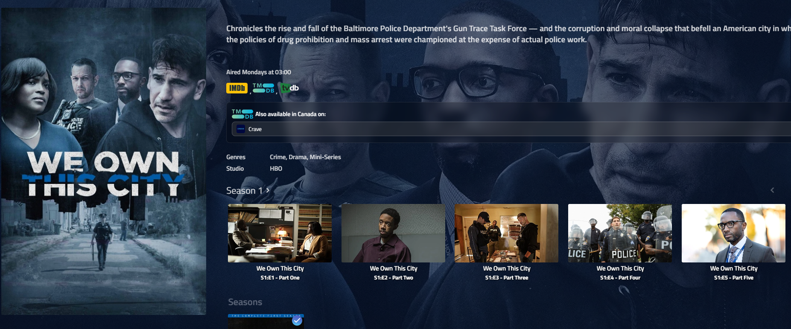

# KefinTweaks for Jellyfin

KefinTweaks is a comprehensive collection of enhancements and customizations for Jellyfin, focused on, but not limited to, filling gaps in functionality based on the community's most desired [Feature Requests](https://features.jellyfin.org/?view=most-wanted).  

While working on these scripts to meet my personal needs, I noticed that there was a lot of overlap between the functionality I desire and many of the requested features by the community so I thought it would be a good idea to share this for anyone who may be interested. 

There is no configuration required, but if you wish to customize some of the features, there are options to do so.

I think it's also worth mentioning that before the 1.0 release, you can expect to potentially encounter some issues or bugs. I try to address these as quickly as I can, and I appreciate your time for raising the issues in the first place!

Note: The Slideshow at the top of the Home Screen in the video below is from the [MediaBar](https://github.com/IAmParadox27/jellyfin-plugin-media-bar) plugin by [IAmParadox27](https://github.com/IAmParadox27) and [MakD](https://github.com/MakD).

[](https://youtu.be/4ikW4CFSn3I)

## Table of Contents

- [Installation](#installation)
  - [Prerequisites](#prerequisites)
  - [Setup Instructions](#setup-instructions)
- [Configuration](#configuration)
- [Features Overview](#features-overview)
  - [Data Caching](#data-caching)
  - [Community Requests Progress](#community-request-progress)
    - [Feature Requests Completed](#-feature-requests-completed)
    - [Feature Requests Planned](#-feature-requests-planned)
  - [Core Features](#core-features)
    - [Watchlist](#watchlist)
      - [Watchlist Page](#watchlist-page)
      - [Series Progress Page](#series-progress)
      - [Movie History Page](#movie-history)
      - [User Statistics Page](#statistics)
      - [Export/Import](#exportimport)
    - [Enhanced Home Screen](#enhanced-home-screen)
    - [Enhanced Search](#enhanced-search)
  - [UI Enhancements](#ui-enhancements)
    - [Watchlist Support](#watchlist-support)
    - [Skin Manager](#skin-manager)
  - [UX Improvements](#ux-improvements)
    - [Subtitle Search](#subtitle-search)
    - [Remove from Continue Watching](#remove-from-continue-watching)
    - [Collection Sorting](#collection-sorting)
  - [Navigation Improvements](#navigation-improvements)
    - [Header Tab Enhancements](#header-tab-enhancements)
    - [Breadcrumb Navigation](#breadcrumb-navigation)
    - [Custom Menu Integration](#custom-menu-integration)
    - [Playlist Screen Improvement](#playlist-screen-improvement)
    - [Flatten Single Season Shows](#flatten-single-season-shows)
    - [Collections on Movie/Series Details page](#collections-on-movieseries-details-page)
  - [System Improvements](#system-improvements)
    - [Performance & Stability](#performance--stability)
    - [Branding & Customization](#branding--customization)
- [Script Details](#script-details)
  - [Dependency Scripts](#dependency-scripts)
  - [Feature Scripts](#feature-scripts)
  - [Auto-Inject Dependencies](#auto-inject-dependencies)
  - [Info For Developers](#info-for-developers)
- [Client Support](#client-support)
- [Changes to default Jellyfin functionality](#changes-to-default-jellyfin-functionality)
- [Design Philosophy](#design-philosophy)
- [AI Disclaimer](#ai-disclaimer)
- [License](#license)
- [Acknowledgments](#acknowledgments)
- [Support](#support)
- [Roadmap](#roadmap)
  - [Planned Features](#planned-features)
  - [Version History](#version-history)

## Installation

### Prerequisites
- Jellyfin 10.10.7 or earlier (10.11.X is untested and "unsupported" but may be mostly functional)
- [JS Injector](https://github.com/n00bcodr/Jellyfin-JavaScript-Injector) plugin installed and configured
- Only required for Watchlist: [Custom Tabs](https://github.com/IAmParadox27/jellyfin-plugin-custom-tabs) plugin

### Setup Instructions

0. **Install the Prerequisites listed above**  
1. **Add a new script to your JS Injector Plugin**
2. **Copy the code below, paste it into the new script, save your changes and refresh the page**

```javascript
const script = document.createElement("script");
script.src = `https://cdn.jsdelivr.net/gh/ranaldsgift/KefinTweaks@latest/kefinTweaks-plugin.js`;
script.async = true;
document.head.appendChild(script);
```

If you are hosting the script yourself, replace the `https://cdn.jsdelivr.net/gh/ranaldsgift/KefinTweaks@latest/` with your hosted location + `/KefinTweaks/`. You should be able to include the scripts in your jelly-web folder and access it from `/web/KefinTweaks` if you like.

3. **Navigate to the Plugins page and click on KefinTweaks**
4. **Choose your preferred plugin version, or specify a custom source if you are self hosting the scripts**
5. **Press Install! KefinTweaks will automatically load without refreshing the page**

<div align="center">
  
</div> 
<br/>  
<hr>

## Configuration

KefinTweaks includes a comprehensive configuration interface accessible to administrators. The configuration UI allows you to customize all aspects of KefinTweaks without editing code files.

### Accessing Configuration

The configuration interface can be accessed in multiple ways:

1. **From Dashboard**: In the Dashboard side menu, find the "KefinTweaks" button under the Plugins section.
2. **From Left Navigation Menu**: A "Configure" link will appear in the left navigation menu beneath a KefinTweaks heading.
3. **From User Preferences**: Navigate to your User Preferences page and find the "Administration" section. Click the "Configure KefinTweaks" button.

### Configuration Features

All configuration options for KefinTweaks can be managed directly from the UI.

- **Feature Toggle**: Toggle individual KefinTweaks features on or off
- **Home Screen Configuration**: Configure custom sections, discovery features, and seasonal content
- **Search Configuration**: Enable/disable Jellyseerr integration
- **Skin Configuration**: Manage available skins, set default skins, and enable/disable specific skins
- **Theme Configuration**: Add custom themes available to all users
- **Exclusive Elsewhere Configuration**: Configure branding behavior
- **Custom Menu Links**: Add custom links to the navigation menu
- **Script Root URLs**: Configure custom script hosting locations (advanced)

### Export and Import

- **Export**: Export your entire configuration to clipboard as JSON for backup or sharing
- **Import**: Import a previously exported configuration to restore settings or apply configurations from other servers

<div align="center">
  
</div>
<br/>

<div align="center">
  
</div>
<br/>

### Automatic Setup

On first load, KefinTweaks automatically:
- Creates the `KefinTweaks-Config` script in the JavaScript Injector plugin with default settings
- Ensures the Watchlist tab exists in the CustomTabs plugin with the correct HTML structure

These tasks only run for administrator users and happen automatically in the background.
<hr>

## Uninstallation

1. **Navigate to the Plugins page and click on KefinTweaks**
2. **Press Uninstall and click to confirm**

<div align="center">
  
</div> 
<br/>  
<hr>


## Features Overview

KefinTweaks provides a modular system of enhancements that can be individually enabled or disabled based on your needs. Each script is designed to work independently while sharing common utilities and dependencies.

As mentioned above, most of the functionality included in KefinTweaks are features that have been requested by the community. Some of these requests have been pending for 5 years or more. I feel that a lot of the top requests have functionality that is essential to the Jellyfin experience but I have also included less requested features, as well as some things that I just personally needed or wanted.

## Data Caching

One thing that I feel is worth pointing out is the way in which some of the data needed by KefinTweaks is handled. For most of the features, data is grabbed on demand as normal, same as any existing Jellyfin functionality. However there are specific features, or subsets of features which do use local device caching in order to either improve performance, or simply because it is not feasible to fetch the data each time. In the future if this ever becomes a plugin, the caching can be more intelligent and done on the server.

The features in KefinTweaks which use local data caching are listed below, along with accompanying explanations for why they are being cached. Everything is cached by default for 24h unless it is specified otherwise. 
- Home Screen  
  - **Genres** [24h]:  
  Genres are cached simply to reduce API calls to the server. This is not an expensive API call, but under most circumstances the results will be the same even across longer periods of time.
  - **Top People** [7d]:  
  In order to populate the "Top People" in your movie library, we fetch the Person data for every movie in your library. We build a list of all the People who appear in at least X number of items based on their type (Actor/Director/Writer). This is an expensive operation, and is longer as the size of your library grows.
- Watchlist
  - **Watchlist Items** [5m]:  
  These items are only cached after they are fetched on first page load. This means every time you refresh the page we fetch this data from the server and then in most situations will simply re-use that data until it expires 5 minutes later, or when the user manually refreshes the page.
  - **Series Progress and Movie History** [24h]:  
  These are both more expensive operations, especially if you have watched a very high number of Movies or Shows. It's not practical to fetch this data on demand so we cache it to improve UX.
- Collections on Details Page  
  - **Collections** [1h]:  
  These items are only cached after they are fetched on first page load. Sadly I know no way to retreive a list of Collections that an Item is a child of from the API directly. The Ancestors endpoint only returns the physical ancestors of an item. In order to be able to populate the "Included In" section, we fetch the children from every Collection in your library and add the Item ID of each child to the cache.
  <hr>

## Community Request Progress

### ✅ **Feature Requests Completed**

- ✅ [Remove items from Continue Watching](https://features.jellyfin.org/posts/517/add-an-option-to-remove-an-item-from-continue-watching)
- ✅ [Watchlist like Netflix](https://features.jellyfin.org/posts/576/watchlist-like-netflix)
- ✅ [Remove pagination in favor of infinite scroll for library pages](https://features.jellyfin.org/posts/216/remove-pagination-use-lazy-loading-for-library-view)
- ✅ [Watched History](https://features.jellyfin.org/posts/633/watched-history)
- ✅ [On-Demand Subtitle Search in Video OSD](https://features.jellyfin.org/posts/3385/on-demand-subtitle-search)
- ✅ [Add genres and recommendations to home screen](https://features.jellyfin.org/posts/3501/add-genres-and-recommendations-to-home-screen)
- ✅ [New or Improved Home Screen Sections](https://features.jellyfin.org/posts/1986/new-or-improved-home-secreen-sections)
- ✅ [Custom Carousel Options on Home Screen](https://features.jellyfin.org/posts/1439/custom-carousel-options-on-home-screen)
- ✅ [Improved Playlist UX](https://features.jellyfin.org/posts/2823/playlist-moviesummary)
- ✅ [Flattening TV Shows with 1 season](https://features.jellyfin.org/posts/8/flattening-tv-shows) [[2]](https://features.jellyfin.org/posts/3352/add-option-to-flatten-single-season-tv-shows-skip-season-level)
- ✅ [List all collections that an item belongs to on the details page](https://features.jellyfin.org/posts/540/list-all-collections-that-a-movie-belong-to-in-movie-details) [[2]](https://features.jellyfin.org/posts/3540/collection-data-present-on-content-within-the-collection) [[3]](https://features.jellyfin.org/posts/3549/show-collections-on-movie-page)
- ✅ [Custom Skins/Themes](https://features.jellyfin.org/posts/2509/themes-skins-or-clone-plex-layout-to-convert-the-rest-of-the-plex-and-emby-user-base-to-jellyfin) [[2]](https://features.jellyfin.org/posts/2616/theme-skins)
- ✅ [TV Season Selection at the Series level](https://forum.jellyfin.org/t-tv-season-selection-when-browsing-seasons)

### 🚧 **Feature Requests Planned**

- 🚧 [Add end time to detail page for entire shows and seasons](https://features.jellyfin.org/posts/3470/add-info-ends-at-hh-mm-for-each-season-and-whole-show)
- 🚧 [Keep original title option](https://features.jellyfin.org/posts/32/keep-original-title-option)
- 🚧 [Search by tag/genre](https://features.jellyfin.org/posts/276/search-by-tag-genre)
- 🚧 [Add drag and drop to library order](https://features.jellyfin.org/posts/3509/add-drag-and-drop-to-libray-order)
<hr>

### Core Features

## **Watchlist**
### **Watchlist Page**:  
Tired of forgetting everything you wanted to watch? Add movies, series, seasons, and episodes to your Watchlist!  

<div align="center">
  
</div>  
<br/>  

### **Series Progress**:  
An overview of every series you've ever started watching with functionality to filter, sort and mark items as watched.  

<div align="center">
  
</div>  
<br/>  

### **Movie History**:  
An overview of every movie you've ever watched with functionality to filter, sort and mark items as favorites.  

<div align="center">
  
</div>  
<br/>  

### **Statistics**:  
A summary of your watched items by the numbers. See how many movies, shows or episodes you have watched.  

<div align="center">
  
</div>

### **Export/Import**:  
Export your Watchlist to JSON which can later be imported using the Watchlist Import feature. You can use this feature to make bulk changes to your Watchlist if you need to.

<table align="center" style="width: 100%;">
  <tr>
    <th style="text-align:center;">Watchlist Export</th>
    <th style="text-align:center;">Watchlist Import</th>
  </tr>
  <tr>
    <td style="width: 50%;"></td>
    <td style="width: 50%;"></td>
  </tr>
</table>
<br/>  

- **Auto-Remove**:  
Automatically removes watched items from your watchlist when playback completes.  

- **Real-time Updates**:  
Cached watchlist updates when toggling watchlist status from card overlays  
<hr>


#### **Enhanced Home Screen**
- **Custom Sections**:  
Add playlist or collection-based sections to your home screen  

- **New & Trending**:  
Creates sections for movies and episodes released in the last 7 days (trending sections incomplete)  

- **Infinite Discovery Sections**:  
Load discovery sections based on items you've watched and favorited, as well as from genres or top people in your library  

- **HSS Support**:  
Full compatibility with [Home Screen Sections](https://github.com/IAmParadox27/jellyfin-plugin-home-sections) plugin by [IAmParadox27](https://github.com/IAmParadox27/)  

- **Seasonal Content**:  
Seasonally-themed sections (Halloween, Christmas, etc.)  

<div align="center">
  
</div>  
<br/>  

- **Watchlist Integration**:  
Dedicated watchlist section on home screen  

<div align="center">
  
</div>  
<br/>  

#### **Enhanced Search**
- **Performance Improvements**:  
Defaults to searching in Movies/TV/People as most searches are for these items. Options to search specific categories or all categories like the default Jellyfin search functionality.  

- **Jellyseerr Support**:  
If you have [JellyfinEnhanced](https://github.com/n00bcodr/Jellyfin-Enhanced) installed, the Jellyseerr search results will appear in the KefinTweaks enhanced search. There is also a button that lets users search specifically for Requests.

- **Meilisearch Support**:  
Zero-config support for searching with the [Meilisearch](https://github.com/arnesacnussem/jellyfin-plugin-meilisearch) plugin  

<div align="center">
  
</div>  
<br/>
<hr>

### UI Enhancements

#### **Watchlist Support**
- **Watchlist Toggle**:  
Watchlist toggle button added to all item card overlays  

<div align="center">
  
</div>  
<br/>  
<hr>


#### **Skin Manager**

The Skin Manager adds the functionality for users to change the appearance of the Web UI from a button in the top header, or from their Display Preferences in their User Account.

<table align="center" style="width: 100%;">
  <tr>
    <th style="text-align:center; width: 44.2%;">Top Header Button</th>
    <th style="text-align:center;">User Display Preferences</th>
  </tr>
  <tr>
    <td style="width: 35%;"></td>
    <td style="width: 65%;"></td>
  </tr>
</table>
<br/>  

- **Skins**  
Select from a list of pre-defined Skins created by other Jellyfin community members. You may specify additional custom skins in the configuration options.

- **Color Schemes**  
Certain Skins either support or require a color scheme. This lets you change the UI colors within an individual Skin. These options are automatically available for the Skins which support them.
<hr>

### UX Improvements

#### **Subtitle Search**:  
Search and download subtitles directly from the video OSD  

<div align="center">
  
</div>  
<br/>  

#### **Remove from Continue Watching**:  
Adds a card overlay button to remove items from Continue Watching for all resumable items  

<div align="center">
  
</div>  
<br/>  

#### **Collection Sorting**:
Adds the ability to sort collection items on the Collection page. Supports sorting by Title, Release Date, Date Added, Community Rating, Critic Rating.
<hr>

### Navigation Improvements

#### **Header Tab Enhancements**:  
Improved tab navigation and functionality, supports linking to specific tabs  

#### **Breadcrumb Navigation**:  
Clear navigation paths for Movies, Series, Seasons, Episodes, Music Artists, Albums and Songs

<div align="center">
  
</div>  
<br/>  

#### **Custom Menu Integration**:  
Add custom menu links to the side navigation drawer menu  

<div align="center">
  
</div>  
<br/>  

#### **Playlist Screen Improvement**:  
Updates the default playlist functionality to include a play button to start playback and make clicking an item go to the item detail page  

#### **Flatten Single Season Shows**:  
This will display the list of episodes from the first season on the Series details page for Shows which only have 1 season.  

<div align="center">
  
</div>  
<br/>  

#### **Collections on Movie/Series Details page**:  
This shows an "Included In" section on the Item Details page which displays any Collections that the item is a part of.  

<div align="center">
  
</div>  
<br/>  
<hr>


### System Improvements

#### **Performance & Stability**
- **Background Leak Fix**:  
    Resolves an issue that causes backgrounds to be added to the DOM endlesslly when a tab is not focused and Backdrop images are enabled  

- **Infinite Scroll**:  
    Adds infinite scrolling to the Movies and TV library pages. Loads batches of 100 items at a time and supports filtering and sorting.  

- **LocalStorage Caching**:  
    Local caching for data related to Watchlist, Series Progress, Movie History and Top People  

- **Dashboard Button Fix**:  
    Fix to handle navigating back from the dashboard page to the homescreen instead of the "new tab" page of a browser  

#### **Branding & Customization**
- **Exclusive Elsewhere**:  
Custom branding for items which aren't available on any external streaming providers. Requires [JellyfinEnhanced](https://github.com/n00bcodr/Jellyfin-Enhanced).  

- **Ratings and Comments**:  
Coming soon...requires the [Updoot](https://github.com/BobHasNoSoul/jellyfin-updoot) backend script  
<hr>


## Script Details

### Dependency Scripts

| Script | Description |
|--------|-------------|
| `utils.js` | Page view management and common utilities |
| `cardBuilder.js` | Enhanced card building functionality |
| `localStorageCache.js` | Caching layer with TTL management |
| `indexedDBCache.js` | IndexedDB-based caching for large datasets |
| `modal.js` | Generic modal system for dialogs |
| `toaster.js` | Toast notification system |
| `userConfig.js` | User-specific configuration for skins and settings |
| `apiHelper.js` | API helper functions for common operations |

### Feature Scripts

| Script | Description | Dependencies |
|--------|-------------|--------------|
| `watchlist.js` | Complete watchlist management system | `cardBuilder`, `localStorageCache`, `modal`, `utils` |
| `homeScreen.js` | Custom home screen sections | `cardBuilder`, `localStorageCache`, `utils` |
| `search.js` | Enhanced search functionality | `cardBuilder`, `utils` |
| `headerTabs.js` | Header tab improvements | None |
| `customMenuLinks.js` | Custom menu link handling | `utils` |
| `exclusiveElsewhere.js` | Custom branding for unavailable content | None |
| `updoot.js` | Upvote functionality integration | None |
| `backdropLeakFix.js` | Memory leak fixes | None |
| `dashboardButtonFix.js` | Dashboard button behavior fix | None |
| `infiniteScroll.js` | Infinite scroll functionality | `cardBuilder` |
| `removeContinue.js` | Remove continue watching functionality | None |
| `subtitleSearch.js` | Subtitle search in video OSD | `toaster` |
| `breadcrumbs.js` | Breadcrumb navigation | `utils` |
| `playlist.js` | Playlist view enhancements | `cardBuilder`, `utils` |
| `itemDetailsCollections.js` | Collections display on item details pages | `indexedDBCache`, `utils`, `cardBuilder` |
| `flattenSingleSeasonShows.js` | Flatten single-season shows to show episodes directly | `cardBuilder`, `utils` |
| `skinManager.js` | Skin selection and management | `utils`, `userConfig` |
| `collections.js` | Collection sorting functionality | `utils`, `modal` |
| `sonarrRequests.js` | Sonarr request functionality for missing episodes and series | None |
| `deviceManager.js` | Device management with remove device functionality | `utils` |
<br>

### Auto-Inject Dependencies

KefinTweaks automatically enables required dependencies when you enable a script that needs them. For example:

- Enabling `watchlist` automatically enables `cardBuilder`, `localStorageCache`, `modal`, and `utils`

This ensures all scripts have their required dependencies without manual configuration.  

### Info for Developers

This section will detail any information relevant for other developers who wish to take advatange of KefinTweaks features in their own projects:

Currently the only functionality that can be very easily included by developers of other projects is the Watchlist functionality.

The KefinTweaks Watchlist leverages the existing Jellyfin Item UserData field: "Likes". Here is how KefinTweaks handles the funcionality and how you can as well:

- Add a section (on the home screen or elsewhere) which queries the Items endpoint with `Filters=Likes`
- Add a Watchlist toggle button to all card overlays which toggles the UserData Likes value
- Add a listener for PlaybackStopped to check if a Watchlisted item has been watched and automatically remove it from the Watchlist

Even if you only implement the first bullet point and add a section for Watchlist items, KefinTweaks will automatically handle Watchlist syncing whenever the user connects with a KefinTweaks supported client.  
<hr>

## Client Support

KefinTweaks is a front end plugin that relies on the Jellyfin Web UI to function. This means that it will function wherever the Jellyfin Web UI is used, and won't function in any apps that don't use the Web UI.

Here is a list of known supported clients:

- Jellyfin Web - Works on any web browser
- [Jellyfin Media Player](https://github.com/jellyfin/jellyfin-media-player)
- [Jellyfin for Android](https://github.com/jellyfin/jellyfin-android)
- [Jellyfin for iOS](https://github.com/jellyfin/jellyfin-ios)
- [Jellyfin for WebOS](https://github.com/jellyfin/jellyfin-webos)
- [Jellyfin for Tizen](https://github.com/jellyfin/jellyfin-tizen)
<hr>

## Changes to default Jellyfin functionality

A few things to note about KefinTweaks functionality in general and how it interacts with the default Jellyfin functionality:

### What functionality is additive?

- Watchlist
- Series Progress
- Movie History
- User Statistics
- Enhanced Home Screen
- Appearance/Skin Manager
- Subtitle Search in Video OSD
- Remove from Continue Watching
- Breadcrumb Navigation
- Custom Menu Links
- Collections on Details Page

### What functionality is modified?

- Infinite Scroll for Library Pages
  - Pagination controls are hidden in favor of infinite scrolling
- Playlist Page UX
  - Clicking playlist items navigates to the item page instead of playing the item
  - A play button is added to each item on the Playlist page to allow the user to play the item directly
- Flatten Single Season Shows
  - The normal Seasons section is hidden for shows with only 1 season
  - Episodes from the single season are displayed in a section with the Next Up item being the one focused
- Background Leak Fix
  - This removes extra backdrops from the DOM
  - It fixes an issue which causes Jellyfin to endless add backdrop items to the DOM if the Jellyfin browser tab is not focused

  
### What functionality is overridden?

- Search
  - The default Jellyfin search is hidden in favor of the KefinTweaks search
  - KefinTweaks blocks default Jellyfin search requests, and only performs its own search requests
- Dashboard Button Fix
  - This fix prevents the Back button in the Dashboad from navigating back to the "new tab" page in your browser
<hr>

## Design Philosophy

The general design philosophy here is to utilize as much pre-existing Jellyfin functionality as possible in order to ensure long term compatibility, and also to potentially make it a bit easier for anyone interested in taking these ideas into the core Jellyfin projects. Even where functionality is being "overridden" we still typically utilize underlying Jellyfin functionality to achieve the results desired.

The only real Plugin dependency that KefinTweaks has is JS Injector which is being used to both load the KefinTweaks scripts, and save configuration data on the server. Loading the scripts without JS Injector is very simple, but without another way of storing configuration data on the server, JS Injector is absolutely required if you wish to override any of the default configuration options in the UI.

The main goal of this project is to push the limits of what is possible through a "front end plugin". All of the code in this project is executed by the client. This is quite unusual in terms of the typical Jellyfin plugin, but I hope it may be inspiring for other future creations down the road. I would also be very happy if the changes included here helped push forward the progress to get these changes implemented in the core Jellyfin project so that everyone can take advantage of them without needing a third party plugin.
<hr>

## AI Disclaimer

To preface this, I want to say that historically, all of the community oriented projects I have worked on in the past have been composed nearly entirely by code that I have written myself. As new development tools have been released, I have tried to take advantage of them as much as possible in order to improve my own learning and to make my projects better. I understand that everyone has different personal feelings regarding the use of AI, so I wanted to leave a statement to make it clear about how I have chosen to use AI for this project in particular.

I have started this project with a polar opposite approach from my past endeavors. With the rise of "vibe coding" I wanted to see what I could achieve using a similar philosophy. I understand the obvious short comings of using such a methodology, and I believe that in the majority of the situations it will be very detrimental in the long run. Where I can see this type of tool excelling, is the exact use case of KefinTweaks: mostly small self contained scripts which don't rely on any external pieces of logic. This is one of the main motivating factors that led me to believe I could achieve what I desire purely through "vibe coding".

As it stands right now, and how I expect to proceed going forward, is to act in a role of "Project Manager" instead of "coder/developer". I don't blindly include every bit of code that is provided by my prompts. I make very thorough prompts that essentially provide very detailed documentation of the features to be implemented, in the same way a real project manager might provide this documentation to their team. I am not doing this for practice as I no longer professionally work in the design industry and have no plans to, but moreso just for fun and to see what the results are.

The journey so far has been quite enjoyable. The scale of KefinTweaks has expanded a lot over time, so I do certainly have my concerns about the sustainability of this approach, but I plan to continue on like this unless I hit a roadblock. I hope that this choice will not deter you from trying this plugin, but I did want to make the use of AI clear as I understand that it is a hot issue in the industry and around the globe. My personal view is that AI should be used responsibly as a tool, just like any other tool. I think that AI has no place in replacing artists and other creative work that humans carry out.


## License

This project is licensed under the MIT License - see the [LICENSE](LICENSE) file for details.  

## Acknowledgments

- **Jellyfin Team**: For the fantastic Jellyfin media server
- **[n00bcodr](https://github.com/n00bcodr)**: For JellyfinEnhanced, the JS Injector Plugin and moral support
- **[IAmParadox27](https://github.com/IAmParadox27)**: For the Custom Tabs Plugin
- **[BobHasNoSoul](https://github.com/BobHasNoSoul)**: For the jellyfin-updoot functionality
- **[The Jellyfin Community](https://discord.gg/v7P9CAvCKZhttps://discord.gg/v7P9CAvCKZ)**: For sharing knowledge and providing a welcoming environment to ask questions and learn 
- **[movie-monk-b0t](https://github.com/movie-monk-b0t)**: For the IMDb Top 250 JSON data
- **[joshmcrty](https://github.com/joshmcrty)**: For the [Flurry](https://github.com/joshmcrty/Flurry) jQuery plugin

## Support

- **Issues**:  
KefinTweaks is not maintained by the Jellyfin team, and as a result you are encouraged to seek support from me directly. Sadly, there is no place suitable for discussion of plugins built by community members or fan-made projects in the official Jellyfin Discord, so please visit the [Jellyfin Community Discord](https://discord.gg/v7P9CAvCKZhttps://discord.gg/v7P9CAvCKZ) to find me (username: HighImKevin) and other users who would be happy to help you out. Please also feel free to report bugs and request features from the Issues page.  

- **Documentation**:  
This README and the inline comments in kefinTweaks.js and the other scripts is the only real documentation available at this time  
<hr>

## Roadmap

### Planned Features
- **Jellyfin 10.11 Support**  
- **Additional options for User configuration in the Jellyfin UI**

<hr>

### Version History
- **v0.3.5**: Critical bug fix
- **v0.3.4**: Improved handling of Latest/Development branches for KefinTweaks installation. Improved collection caching.
- **v0.3.3**: Important fix for a bug preventing the plugin from running on non-admin accounts
- **v0.3.2**: Add proper installation and uninstallation support from the Plugins page. New feature: Playlist sorting.
- **v0.3.1**: New Home Screen Section feature: Spotlights! Improved Configuration UI.
- **v0.3.0**: KefinTweaks configuration for admins in the Jellyfin UI!
- **v0.2.4**: New Feature: Watchlist Export/Import
- **v0.2.3**: New Feature: Collection Sorting, general fixes
- **v0.2.2**: Add support for skin server versions, fixes for HeaderTabs
- **v0.2.1**: Caching improvements for Watchlist and Top People, Mobile UI fixes and Flatten TV Shows improvements
- **v0.2.0**: New Features: Skin Manager, Collections on Details Page, Flatten TV Shows
- **v0.1.3**: Improve Watchlist UI and Search UX
- **v0.1.2**: Added proper support for Base URLs configured in Jellyfin
- **v0.1.1**: Fixes for Watchlist UI elements and performance improvements for Watchlist and Search
- **v0.1.0**: Initial release for Jellyfin 10.10.7
