# KefinTweaks for Jellyfin

KefinTweaks is a comprehensive collection of enhancements and customizations for Jellyfin, focused on, but not limited to, filling gaps in functionality based on the community's most desired [Feature Requests](https://features.jellyfin.org/?view=most-wanted). While working on these scripts to meet my personal needs, I noticed that there was a lot of overlap between the functionality I desire and many of the requested features by the community so I thought it would be a good idea to share this for anyone who may be interested. There is no configuration required, but if you wish to customize some of the features, there are options to do so.

## Table of Contents

- [📦 Installation](#-installation)
  - [Prerequisites](#prerequisites)
  - [Setup Instructions](#setup-instructions)
- [Features Overview](#features-overview)
  - [📋 Core Features](#-core-features)
    - [Watchlist Page](#watchlist-page)
    - [Enhanced Home Screen](#enhanced-home-screen)
    - [Enhanced Search](#enhanced-search)
  - [🎨 UI Enhancements](#-ui-enhancements)
    - [Watchlist Support](#watchlist-support)
    - [Navigation Improvements](#navigation-improvements)
  - [🔧 System Improvements](#-system-improvements)
    - [Performance & Stability](#performance--stability)
    - [Branding & Customization](#branding--customization)
- [🛠️ Script Details](#️-script-details)
  - [Core Scripts](#core-scripts)
  - [Feature Scripts](#feature-scripts)
- [Auto-Inject Dependencies](#auto-inject-dependencies)
- [📄 License](#-license)
- [🙏 Acknowledgments](#-acknowledgments)
- [📞 Support](#-support)
- [🔮 Roadmap](#-roadmap)
  - [Planned Features](#planned-features)
  - [Version History](#version-history)

## 📦 Installation

### Prerequisites
- Jellyfin 10.10.7 or later
- [JS Injector](https://github.com/n00bcodr/Jellyfin-JavaScript-Injector) plugin installed and configured
- [Custom Tabs](https://github.com/IAmParadox27/jellyfin-plugin-custom-tabs) plugin for watchlist functionality
- [JellyfinEnhanced](https://github.com/n00bcodr/Jellyfin-Enhanced) plugin for Jellyseerr search functionality and ExclusiveElsewhere

### Setup Instructions

0. **Install Prerequisites listed above**
1. **Add a new script to your JS Injector Plugin**
2. **Copy this entire contents of kefinTweaks.js into the new script**

**Optionally update the "scriptRoot" in the KefinTweaks script if you wish to customize and host these scripts yourself.**

3. **Ensure the script is enabled**
4. **Save your changes**

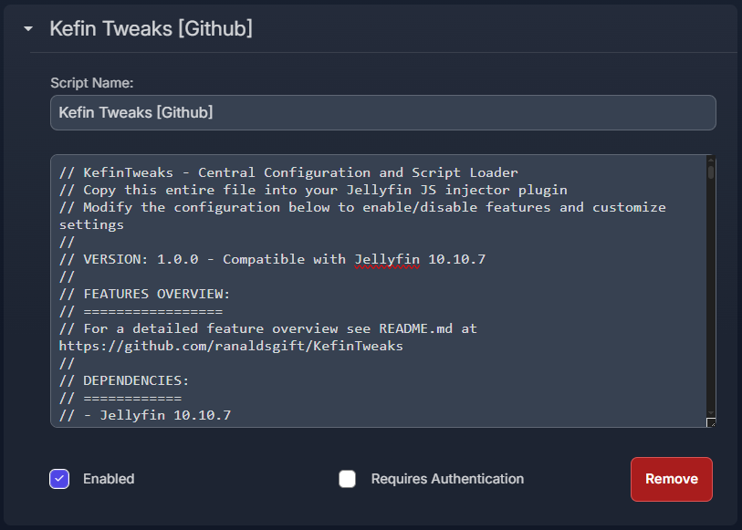<br>

5. **Required for Watchlist: Add a new tab to your Custom Tabs plugin with the following content**
   ```html
   <div class="sections watchlist"></div>
   ```
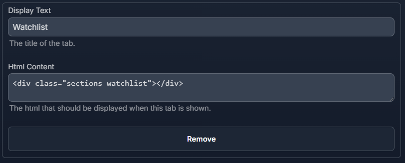<br>

## Features Overview

KefinTweaks provides a modular system of enhancements that can be individually enabled or disabled based on your needs. Each script is designed to work independently while sharing common utilities and dependencies.

### ✅ **Feature Requests Completed**

- ✅ [Remove items from Continue Watching](https://features.jellyfin.org/posts/517/add-an-option-to-remove-an-item-from-continue-watching)
- ✅ [Watchlist like Netflix](https://features.jellyfin.org/posts/576/watchlist-like-netflix)
- ✅ [Remove pagination in favor of infinite scroll for library pages](https://features.jellyfin.org/posts/216/remove-pagination-use-lazy-loading-for-library-view)
- ✅ [Watched History](https://features.jellyfin.org/posts/633/watched-history)
- ✅ [On-Demand Subtitle Search in Video OSD](https://features.jellyfin.org/posts/3385/on-demand-subtitle-search)
- ✅ [Add genres and recommendations to home screen](https://features.jellyfin.org/posts/3501/add-genres-and-recommendations-to-home-screen)
- ✅ [Improved Playlist UX](https://features.jellyfin.org/posts/2823/playlist-moviesummary)

### 🚧 **Feature Requests Planned**

- 🚧 [Flattening TV Shows with 1 season](https://features.jellyfin.org/posts/8/flattening-tv-shows)
- 🚧 [List all collections that an item belongs to on the details page](https://features.jellyfin.org/posts/540/list-all-collections-that-a-movie-belong-to-in-movie-details)
- 🚧 [Add end time to detail page for entire shows and seasons](https://features.jellyfin.org/posts/3470/add-info-ends-at-hh-mm-for-each-season-and-whole-show)  

### 📋 Core Features

#### **Watchlist Page**
- **Watchlist**: Add movies, series, seasons, and episodes to your watchlist with intelligent caching
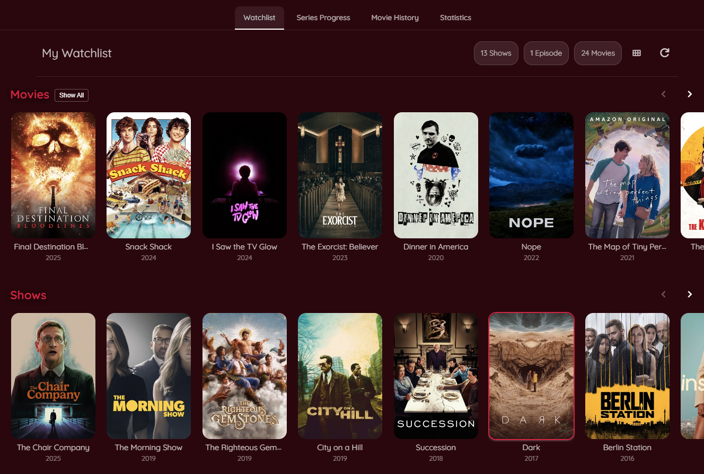<br>

- **Series Progress**: An overview of every series you've ever started watching with functionality to filter, sort and mark items as watched.
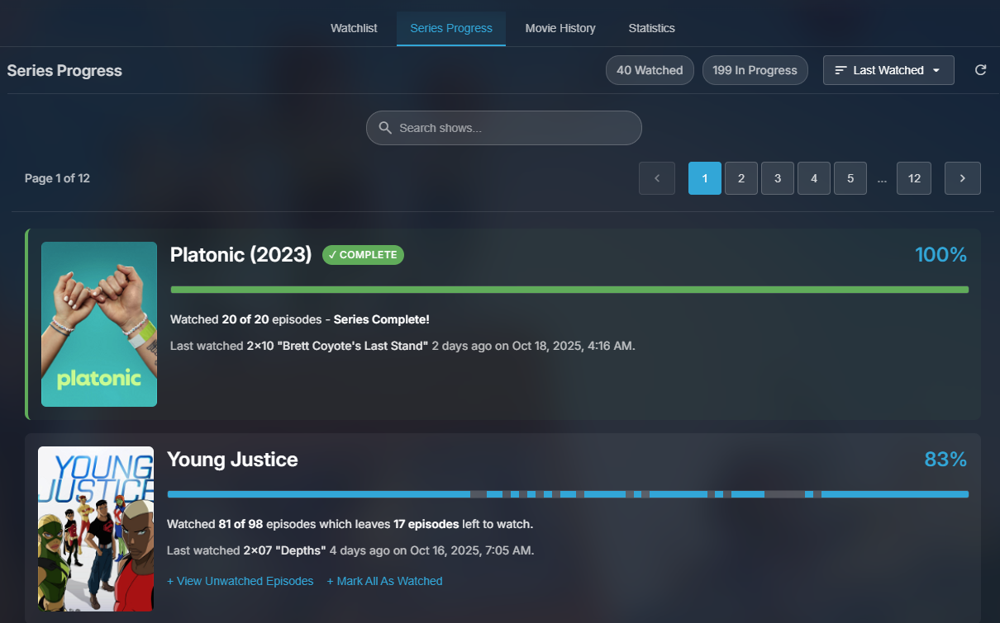<br>

- **Movie History**: An overview of every movie you've ever watched with functionality to filter, sort and mark items as favorites.
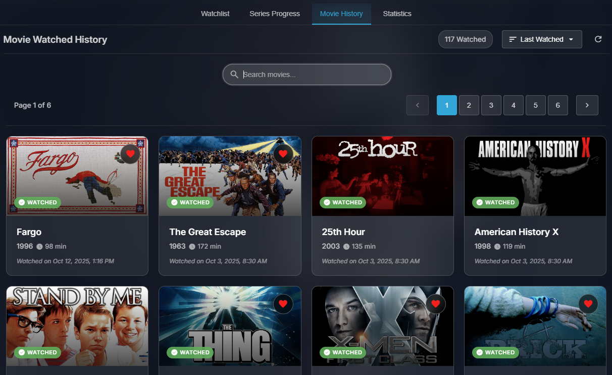<br>

- **Statistics**: A summary of your watched items by the numbers. See how many movies, shows or episodes you have watched.
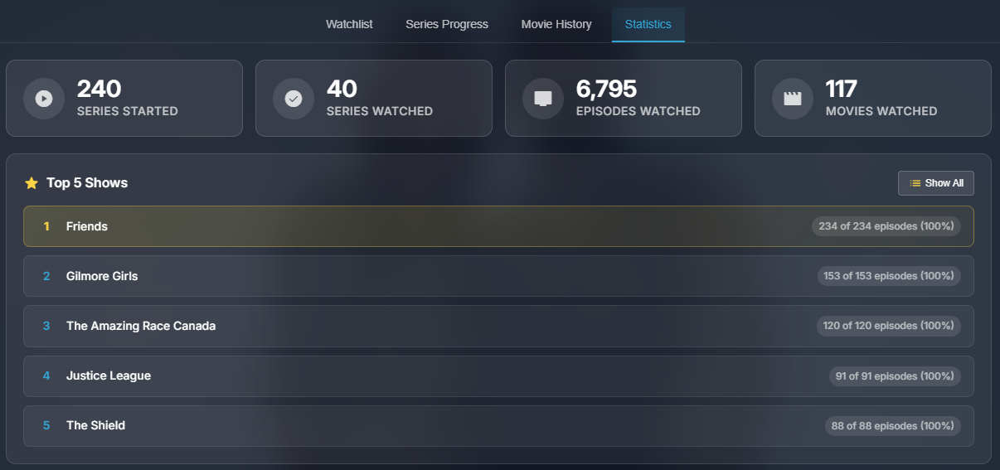<br>

- **Auto-Remove**: Automatically removes watched items from your watchlist when playback completes.
- **Real-time Updates**: Cached watchlist updates when toggling watchlist status from card overlays

#### **Enhanced Home Screen**
- **Custom Sections**: Add playlist or collection-based sections to your home screen
- **New & Trending**: Creates sections for movies and episodes released in the last 7 days (trending sections incomplete)
- **Infinite Discovery Sections**: Load discovery sections based on items you've watched and favorited, as well as from genres or top people in your library
- **Seasonal Content**: Seasonally-themed sections (Halloween, Christmas, etc.)
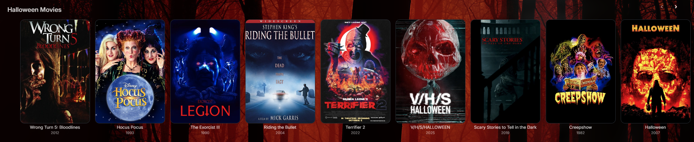<br>
- **Watchlist Integration**: Dedicated watchlist section on home screen
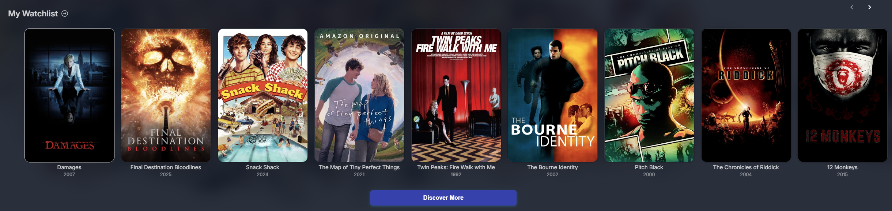<br>

#### **Enhanced Search**
- **Performance Improvements**: Defaults to searching in Movies/TV/People as most searches are for these items. Options to search specific categories or all categories like the default Jellyfin search functionality.
- **Jellyseerr Support**: Zero-config support for Jellyseerr results if [JellyfinEnhanced](https://github.com/n00bcodr/Jellyfin-Enhanced) is installed
- **Meilisearch Support**: Zero-config support for searching with the [Meilisearch](https://github.com/arnesacnussem/jellyfin-plugin-meilisearch) plugin
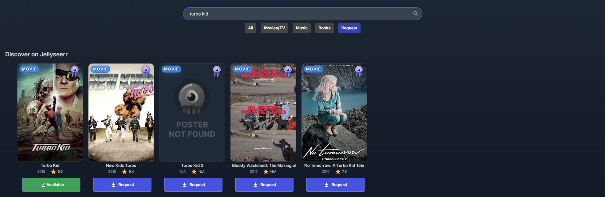<br>

### 🎨 UI Enhancements

#### **Watchlist Support**
- **Watchlist Toggle**: Watchlist toggle button added to all item card overlays
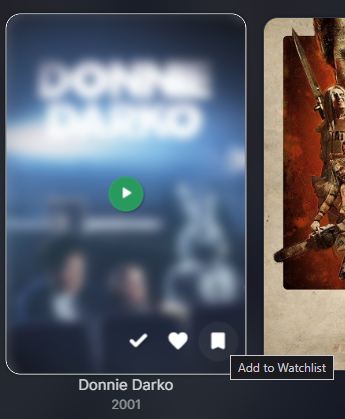<br>

#### **Navigation Improvements**
- **Header Tab Enhancements**: Improved tab navigation and functionality, supports linking to specific tabs
- **Breadcrumb Navigation**: Clear navigation paths for Movies, Series, Seasons, Episodes, Music Artists, and Albums
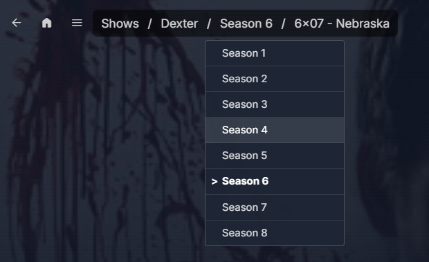<br>

- **Custom Menu Integration**: Add custom menu links to the side navigation drawer menu
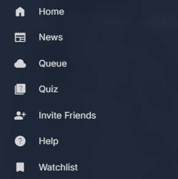<br>

- **Subtitle Search**: Search and download subtitles directly from the video OSD
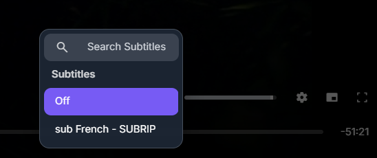<br>

- **Remove Continue Watching**: Adds a card overlay button to remove items from Continue Watching for all resumable items
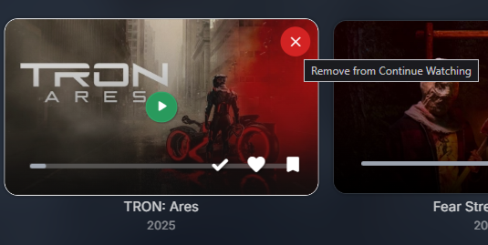<br>

- **Playlist Screen Improvement**: Updates the default playlist functionality to include a play button to start playback and make clicking an item go to the item detail page

### 🔧 System Improvements

#### **Performance & Stability**
- **Background Leak Fix**: Resolves an issue that causes backgrounds to be added to the DOM endlesslly when a tab is not focused and Backdrop images are enabled
- **Infinite Scroll**: Adds infinite scrolling to the Movies and TV library pages. Loads batches of 100 items at a time and supports filtering and sorting.
- **LocalStorage Caching**: Local caching for data related to Watchlist, Series Progress, Movie History and Top People
- **Dashboard Button Fix**: Fix to handle navigating back from the dashboard page to the homescreen instead of the "new tab" page of a browser

#### **Branding & Customization**
- **Exclusive Elsewhere**: Custom branding for items which aren't available on any external streaming providers. Requires [JellyfinEnhanced](https://github.com/n00bcodr/Jellyfin-Enhanced).
- **Ratings and Comments**: Coming soon...requires the [Updoot](https://github.com/BobHasNoSoul/jellyfin-updoot) backend script

## 🛠️ Script Details

### Core Scripts

| Script | Description |
|--------|-------------|
| `utils.js` | Page view management and common utilities |
| `cardBuilder.js` | Enhanced card building functionality |
| `localStorageCache.js` | Caching layer with TTL management |
| `modal.js` | Generic modal system for dialogs |

### Feature Scripts

| Script | Description | Dependencies |
|--------|-------------|--------------|
| `watchlist.js` | Complete watchlist management system | `cardBuilder`, `localStorageCache`, `modal`, `utils` |
| `homeScreen.js` | Custom home screen sections | `cardBuilder`, `localStorageCache`, `utils` |
| `search.js` | Enhanced search functionality | `cardBuilder`, `utils` |
| `headerTabs.js` | Header tab improvements | None |
| `customMenu.js` | Custom menu link handling | `utils` |
| `exclusiveElsewhere.js` | Custom branding for unavailable content | None |
| `updoot.js` | Upvote functionality integration | None |
| `backdropLeakFix.js` | Memory leak fixes | None |
| `dashboardButtonFix.js` | Dashboard button behavior fix | None |
| `infiniteScroll.js` | Infinite scroll functionality | `cardBuilder` |
| `removeContinue.js` | Remove continue watching functionality | None |
| `subtitleSearch.js` | Subtitle search in video OSD | None |
| `breadcrumbs.js` | Breadcrumb navigation | `utils` |
| `playlist.js` | Playlist view enhancements | `cardBuilder`, `utils` |
<br>

## Auto-Inject Dependencies

KefinTweaks automatically enables required dependencies when you enable a script that needs them. For example:

- Enabling `watchlist` automatically enables `cardBuilder`, `localStorageCache`, and `modal`

This ensures all scripts have their required dependencies without manual configuration.

## 📄 License

This project is licensed under the MIT License - see the [LICENSE](LICENSE) file for details.  

## 🙏 Acknowledgments

- **Jellyfin Team**: For the amazing media server platform
- **[n00bcodr](https://github.com/n00bcodr)**: For JellyfinEnhanced, the JS Injector Plugin and moral support
- **[IAmParadox27](https://github.com/IAmParadox27)**: For the Custom Tabs Plugin
- **[BobHasNoSoul](https://github.com/BobHasNoSoul)**: For the jellyfin-updoot functionality
- **[The Jellyfin Community](https://discord.gg/v7P9CAvCKZhttps://discord.gg/v7P9CAvCKZ)**: For sharing knowledge and providing a welcoming enviornment to ask questions and learn 

## 📞 Support

- **Issues**: You can report bugs and request features on GitHub Issues, or visit the [Jellyfin Community Discord](https://discord.gg/v7P9CAvCKZhttps://discord.gg/v7P9CAvCKZ) to DM me (username: HighImKevin)
- **Documentation**: This README and the inline comments in kefinTweaks.js and the other scripts is the only real documentation available at this time

## 🔮 Roadmap

### Planned Features
- **Jellyfin 10.11 Support**: Full compatibility with upcoming Jellyfin versions
- **UI Configuration**: Allow admins to customize the configuration through the UI instead of the JS script

### Version History
- **v1.0.0**: Initial release for Jellyfin 10.10.7
